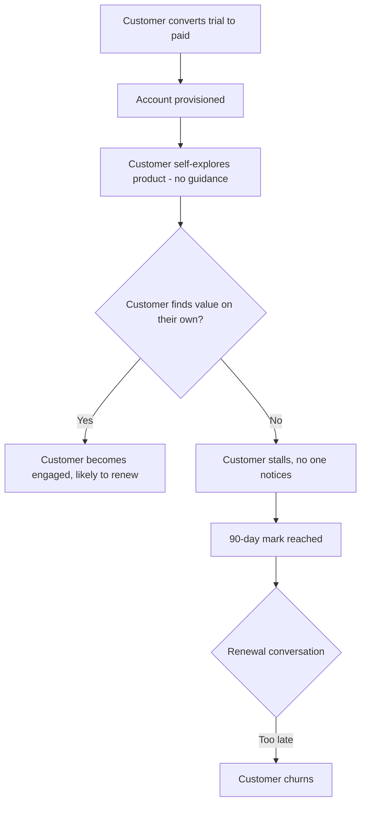
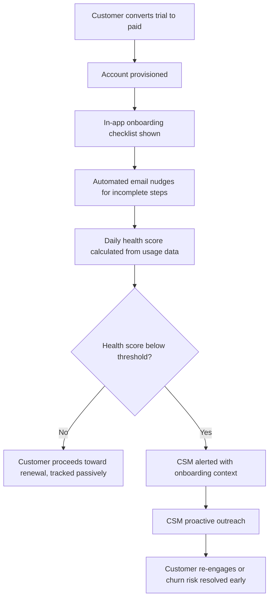

# Process Map — Guided Onboarding & Health-Score Alerts

## As-Is Process (Current State)

**Pain points identified**
- No structured guidance after signup — success depends entirely on the customer's own initiative
- No mechanism exists to detect a stalled account before the renewal conversation
- By the time churn risk is visible, it's usually too late to intervene

## To-Be Process (Redesigned)

**Key changes**
- Guidance is built into the product from day one instead of left to chance
- A daily health score replaces "no signal until renewal" with an early-warning system
- CSM effort is concentrated only on flagged, at-risk accounts — not spread evenly across every account

## Estimated Funnel Impact

| Stage | As-Is | To-Be Target |
|---|---|---|
| Reaches first meaningful outcome within 7 days | ~30% | 70%+ |
| At-risk accounts identified before day 60 | 0% (no signal) | 80%+ |
| 90-day churn | 22% | 13% |
